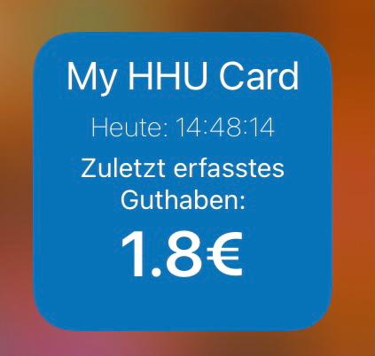
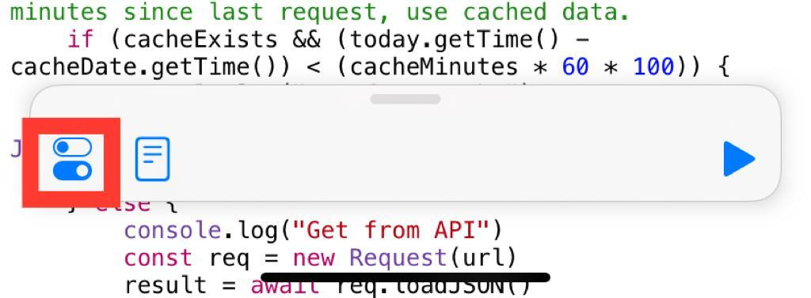
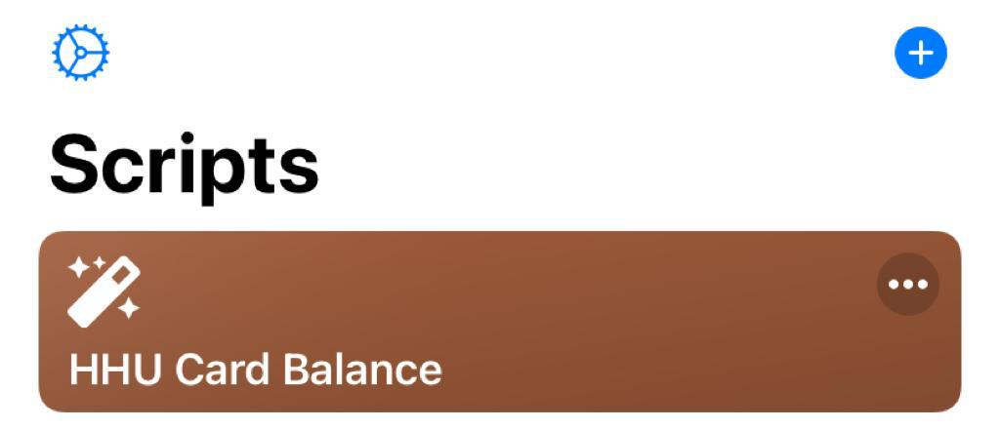
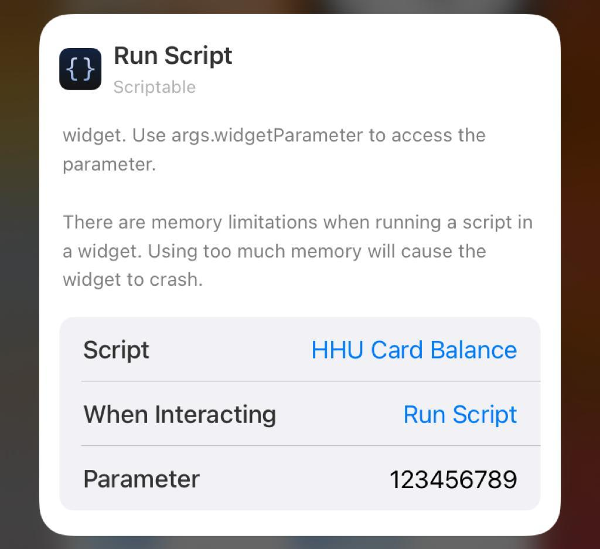

= HHU Card Balance
:icons: font
:icon-set: fa
:source-highlighter: rouge
:experimental:
ifdef::env-github[]
:tip-caption: :bulb:
:note-caption: :information_source:
:important-caption: :heavy_exclamation_mark:
:caution-caption: :fire:
:warning-caption: :warning:
:stem: latexmath
endif::[]

_For English version please read https://github.com/garogarabed12/HHU-Card-Balance/blob/main/README-EN.adoc[README-EN.adoc]_

Ein iOS Widget das ermöglicht allen an der https://www.hhu.de[Heinrich Heine Universität Düsseldorf] ordentlich eingeschriebenen Studierenden
den aktuellen Saldo ihrer https://www.zim.hhu.de/servicekatalog/werkzeuge-fuer-alle/hhu-card[HHU Card] zu überprüfen.

== Anforderungen
* Die App Scriptable, um das Skript zum Laufen zu bringen.
(Die technischen Anforderungen von Scriptable finden Sie im https://apps.apple.com/us/app/scriptable/id1405459188?ign-mpt=uo%3D4[App Store])

* HHU-Card

== Konfiguration
Das Skript befindet sich derzeit noch nicht in der Gallery von Scriptable, deswegen:

* Kopieren Sie den ganzen Code aus der https://github.com/garogarabed12/HHU-Card-Balance/blob/main/HhuCardBalance.js[folgenden Datei].

[WARNING]
Bitte beachten Sie dass Sie wirklich den ganzen Code kopieren, also auch die obigen Kommentare.

* Öffnen Sie Scriptable und klicken Sie auf das + oben rechts und setzen Sie den Inhalt der o.g Datei dort ein.

* Klicken Sie nun auf das im rot markierten Symbol um die Datei in "HHU Card Balance" umzubenennen, und nach Wunsch andere Anpassungen vorzunehmen.

* Nachdem Sie auf _done_ geklickt haben sollte HHU Card Balance unter Scripts gezeigt werden.

* Gehen Sie nun zu Ihren Homescreen und und fügen Sie das Widget von Scriptable hinzu.

* Halten Sie das Widget das Sie gerade hinzugefügt haben gedrückt und klicken Sie _Widget bearbeiten_.

* Für _Script_ wählen Sie _HHU Card Balance_ und für _When Interacting_ wählen Sie _Run Script_ und für _Parameter_ geben Sie die Geldbörsen ID Ihrer HHU Card.

* Wenn Sie jetzt zurückgehen sollten Sie den Saldo Ihrer HHU Card sehen können.

== Kontakt
Für Fragen, Probleme sowie Verbesserungsvorschläge zögern Sie nicht eine neue https://github.com/garogarabed12/HHU-Card-Balance-Widget/issues/new[Issue] zu öffnen.

Made with ❤️ by https://github.com/garogarabed12[Garo Garabed] in Düsseldorf.
